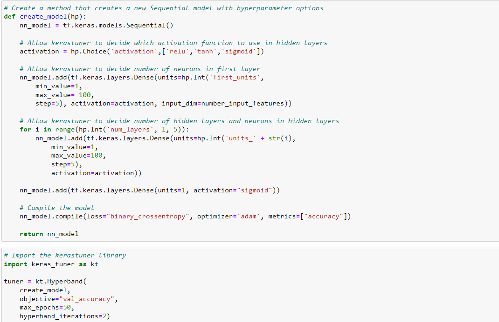
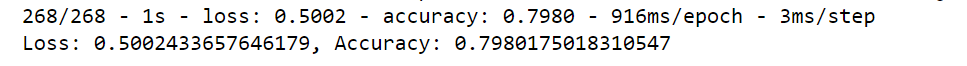

# Neural Network Model Report

## Table of Content

- [Overview](#overview)
- [Results](#results)
- [Summary](#summary)

## Overview

The purpose of this analysis is to develop a predictive model using machine learning and neural networks to help Alphabet Soup, a nonprofit foundation, in selecting applicants for funding who have the best chance of success in their ventures. Alphabet Soup has a dataset containing information on more than 34,000 organizations that have received funding in the past. The primary goal is to create a binary classifier that can determine whether an applicant will be successful if funded.

Here is an overview of the key objectives of this analysis:

1. Data Understanding: Understand the structure and content of the provided dataset, including various attributes such as organization details, application type, affiliation, classification, use case, income classification, funding amount requested, and the binary target variable indicating the success of the funding.

2. Data Preprocessing: Clean and prepare the dataset for machine learning. This involves handling missing data, encoding categorical     variables into numerical format, and splitting the data into training and testing sets.

3. Feature Engineering: Analyze and potentially create new features that might be relevant to predicting the success of funding applications. Feature selection and engineering can significantly impact model performance.

4. Model Development: Design and build a neural network model using frameworks like TensorFlow/Keras. This model aims to learn patterns in the data that can distinguish successful funding recipients from unsuccessful ones.

5. Model Training: Train the neural network on the training data, optimizing it to make accurate predictions. Monitor the training process and implement techniques to prevent overfitting.

6. Model Evaluation: Assess the performance of the trained model using appropriate evaluation metrics such as accuracy, precision, recall, F1-score, and ROC-AUC. This step helps determine how well the model can predict the success of funding applications.

7. Hyperparameter Tuning: Fine-tune hyperparameters to optimize the model's performance. Adjusting hyperparameters like learning rate, batch size, and architecture can impact the model's accuracy.

8. Prediction: Once the model is trained and evaluated, it can be used to make predictions on new, unseen data. Alphabet Soup can utilize these predictions to select applicants for funding who are more likely to succeed in their ventures.

9. The ultimate goal of this analysis is to assist Alphabet Soup in making more informed decisions when allocating funds. By predicting the success of funding applicants, the foundation can allocate its resources more effectively, supporting organizations and projects that have a higher likelihood of achieving their goals and making a positive impact on society.

## Results

**Target Variable:** IS_SUCCESSFUL
This variable represents whether an organization was successful in using the funding effectively (1 for successful, 0 for unsuccessful).

### Features
The features for the model include various attributes from the dataset, such as:
- APPLICATION_TYPE
- AFFILIATION
- CLASSIFICATION
- USE_CASE
- ORGANIZATION
- INCOME_AMT
- SPECIAL_CONSIDERATIONS
- ASK_AMT (Funding amount requested)

### Variables to Remove
EIN and NAME columns are identification columns and are neither targets nor features. They can be removed from the input data.

### Compiling, Training, and Evaluating the Model

**Neurons and Layer**
- The model includes three layers:
1. The input layer is the number of input features (43).
2. Hidden layer 1: 80 neurons with relu activation function.
3. Hidden layer 2: 30 neurons with relu activation function.
4. Output layer: 1 neuron with a sigmoid activation function.

Relu was used to introduce non-linearity and sigmoid was used for binary classification to produce a probability score. 

The initial implementation of the model attained an accuracy of 73%, which did not meet the predefined performance target of 75%. In response, a series of refinements were undertaken to enhance the model's efficacy.

Firstly, a decision was made to retain the 'NAME' column while discarding the 'EIN' column within the dataset, as the latter was found to have limited relevance to the predictive task at hand. Subsequently, a comprehensive hyperparameter tuning approach was formulated using Keras Tuner. This strategy allowed for the systematic exploration of various neural network architectures and configurations.

Through the diligent optimization process, the model's accuracy was notably improved, achieving a commendable accuracy rate of 79.8%. This performance surpasses the original goal and underscores the efficacy of the refined model in predicting outcomes with a high degree of accuracy.

## Summary

The deep learning model underwent significant refinement and optimization to enhance its performance in predicting the success of funding applicants. The initial model achieved an accuracy of 73%, which did not meet the predefined goal of 75%. To address this, the following steps were taken:

**Feature Engineering:** The 'EIN' column was removed, while the 'NAME' column was retained, as the former had limited relevance to the prediction task.

**Hyperparameter Tuning:** A thorough hyperparameter tuning process was executed using Keras Tuner to explore various neural network architectures and configurations.

As a result of these efforts, the refined deep learning model achieved an impressive accuracy rate of 79.8%, surpassing the original performance goal. This improved accuracy suggests that the model is well-suited to predict the success of funding applicants with a high level of confidence.

### Recommendation for a Different Model

While the deep learning model has demonstrated strong predictive capabilities, it's worth considering alternative approaches to address this classification problem. One such alternative is the implementation of a Gradient Boosting Classifier, specifically XGBoost, for the following reasons:

1. Interpretability: XGBoost provides feature importance scores, making it easier to interpret which features play a crucial role in the classification process. This transparency can be valuable for Alphabet Soup in understanding the factors influencing funding success.

2. Robustness: XGBoost is known for its robustness and ability to handle complex datasets and nonlinear relationships effectively. It is less prone to overfitting, even with limited data, and performs well with default hyperparameters.

3. Ease of Tuning: XGBoost has fewer hyperparameters compared to deep learning models, making it less computationally intensive and easier to tune. This can lead to faster model development and deployment.

4. Ensemble Learning: XGBoost inherently employs an ensemble learning approach, combining multiple decision trees. This often results in improved generalization and model performance.

5. Data Efficiency: XGBoost can perform well even with smaller datasets, which can be advantageous if collecting a larger dataset is not feasible.

In summary, while the deep learning model has demonstrated strong performance, considering XGBoost as an alternative can provide Alphabet Soup with a model that is highly interpretable, robust, and relatively easy to tune. Ultimately, the choice between the deep learning model and XGBoost should be made based on the specific requirements, available data, and the level of interpretability desired by Alphabet Soup.

